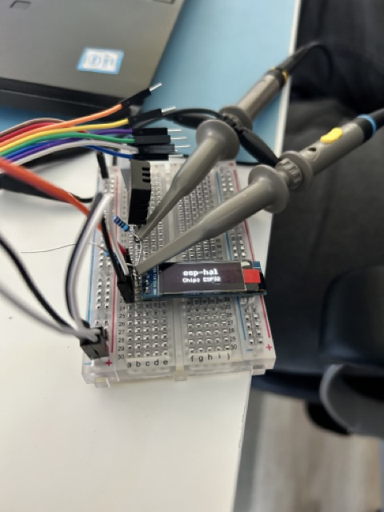

rs-esp32-weatherstation
---

Simple program to display some weather information like temperature, humidity and air quality on a OLED displa

### Ingredients

- LilyGO TTGO T-Beam - LoRa 868MHz - NEO-6M GPS - ESP32
- ASAIR DHT20 Temperature and Humidity Sensor
- ASAIR AGS02MA TVOC Gas Sensor
- 0.91-inch OLED Display 128*32 pixels white

### Getting started

1. Get the drivers for USB to serial connectors https://www.tinytronics.nl/shop/en/drivers-for-usb-to-serial-converters
2. Install espup `cargo install espup` and after that get the a rustc version for esp32 `espup install`
3. Install espflash `cargo install cargoflash`
4. Make sure to run `. /Users/{home_dir}/export-esp.sh` when you open a new terminal
5. Use `cargo espflash flash` to flash the device
6. Use `cargo espflash monitor` to see the serial output
7. To use i2c and such there are great resources at https://github.com/esp-rs
